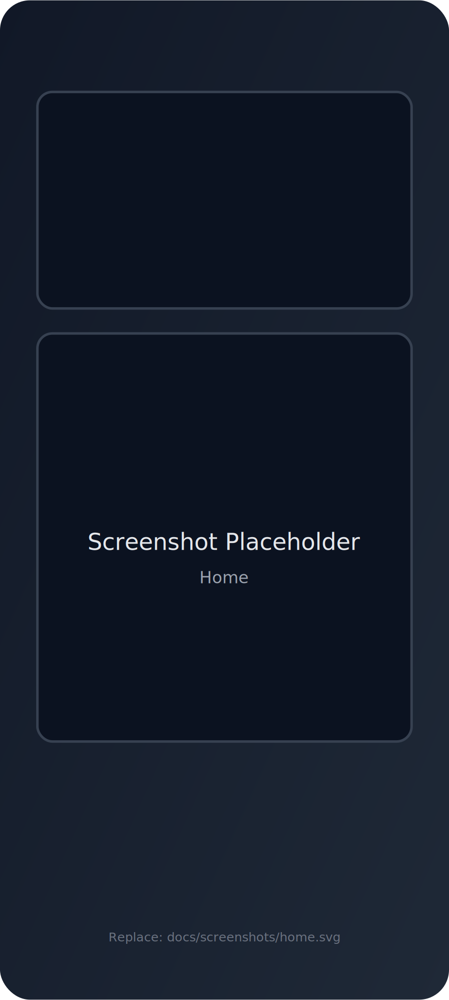
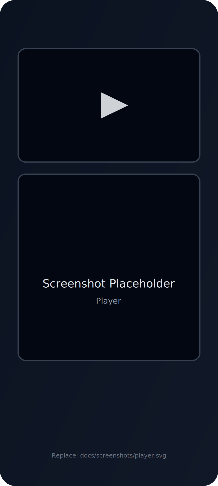
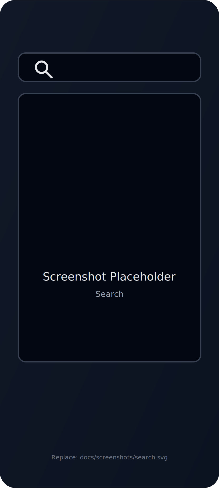
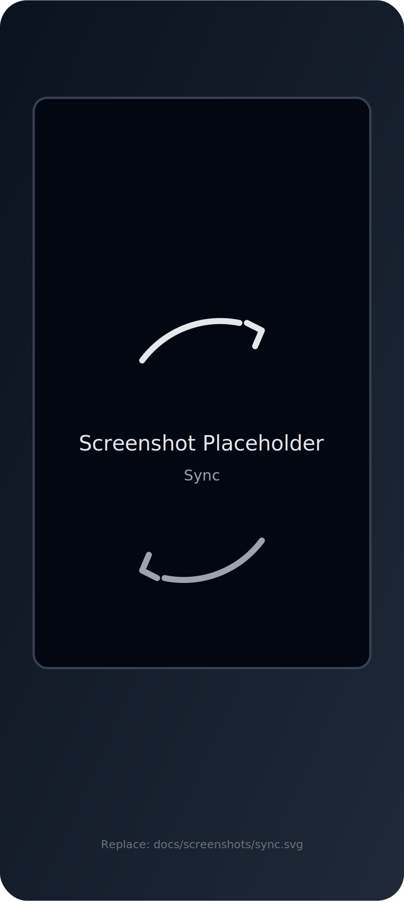
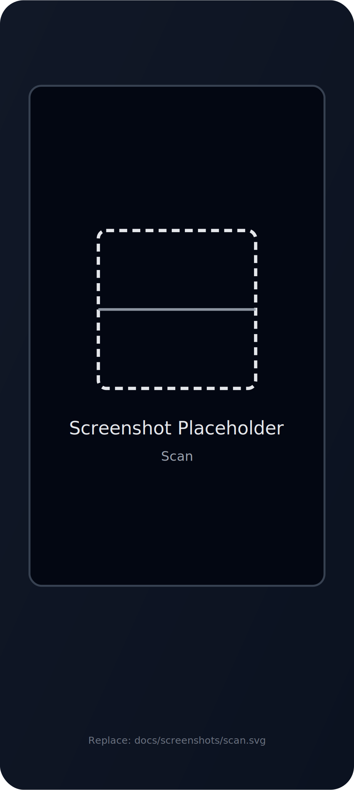

# <p align="center"></p>
## <p align="center">DTV Mobile</p>

<p align="center">
  Kotlin Multiplatform + Compose Multiplatform 项目（Android 优先），用于聚合内容浏览与播放体验。
</p>

---

## 功能

- 多页面浏览：首页 / 搜索 / 播放 /（可选）同步
- 播放能力：基于 Android Media3（ExoPlayer）实现流媒体播放
- 扫码能力：集成 ZXing（用于扫码/同步等场景）
- 网络请求：Ktor Client + Kotlinx Serialization

> 具体功能以代码实现为准。

## 目录结构

- `androidApp/`：Android 应用（入口、Manifest、资源、签名等）
- `shared/`：KMP 共享模块（业务状态、UI、平台适配）
- `desktopApp/`：桌面端（如启用）

## 快速开始（Android）

### 环境要求

- Android Studio（建议使用较新版本）
- JDK 17
- Android SDK（`compileSdk = 36`）

### 运行

```bash
./gradlew :androidApp:installDebug
```

或直接在 Android Studio 里选择 `androidApp` 运行。

### 签名（可选）

仓库默认忽略本地签名文件：`androidApp/keystore.properties`。

如果你需要本地打包 Release：

1. 复制 `androidApp/keystore.properties.example` 为 `androidApp/keystore.properties`
2. 填入自己的 keystore 路径与密码（该文件不会被提交）

## 截图

> 将占位图替换为真实截图即可（建议保持同名文件，直接覆盖）。

| 首页 | 播放 | 搜索 |
| --- | --- | --- |
|  |  |  |

| 同步 | 扫码 |
| --- | --- |
|  |  |

## Roadmap（想法）

- 更完善的播放控制与错误提示
- 更清晰的模块边界与可测试性
- 统一的日志与崩溃收集（可选）

## 贡献

欢迎提 Issue / PR。提交前建议先本地运行：

```bash
./gradlew build
```

